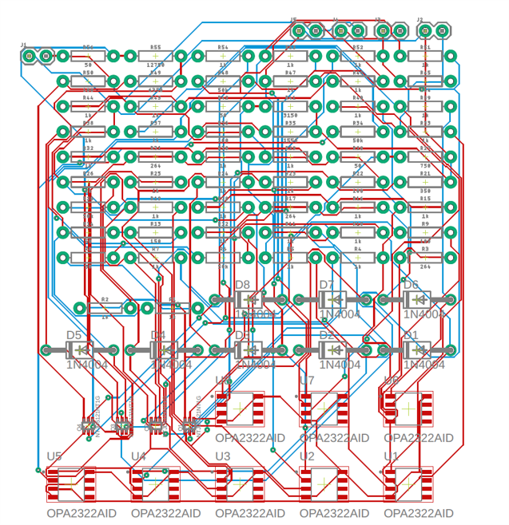

### Welcome to my Projects! Here, you can explore some of the AI/ML and mechanical engineering projects I have worked on.

[Optimizing Ore Mining through Transformer-Based Task Planning: A Generative Model Approach](/projects/transformer-task-planning)    
**Abstract**: This project combines a Transformer model with MCTS to optimize ore mining, improving efficiency, cutting costs, and supporting sustainability.                      
**KeyWords**: Task planning, Monte Carlo Tree Search, Robotics, Deep learning

    

             
[Optimizing Rock Mining using Edge Cost Evaluation and Stone Clustering Techniques](/projects/rock-mining-edge-cost)                
**Abstract**: This project integrates edge cost evaluation and stone clustering to optimize rock mining, enhancing efficiency, ore quality, and cost-effectiveness for autonomous wheel loaders.                                            
**KeyWords**: Stone clustering, Edge cost evaluation, Autonomous wheel loaders

    

             
[Design of Radiation-Resistant Multi-Point Temperature Sensor](/projects/radiation-temperature-sensor-design)             
**Abstract**: This project develops a durable multi-location temperature detection system for high-radiation environments, ensuring precision and reliability through analog circuits with minimal digital components.                       
**KeyWords**: High-radiation environments, Temperature detection, Analog circuits

    

                    
[Axial Velocity Profiles for Developing and Fully Developed Regions](/projects/axial-velocity-cfd)               
**Abstract**: This project conducts a CFD analysis of pipe flow with ANSYS 2022, validating flow development and predicting empirical relationships through velocity profiles, pressure distributions, and entrance lengths.                      
**KeyWords**: Computational Fluid Dynamics (CFD), Pipe flow, Velocity profiles, Pressure distributions

    

