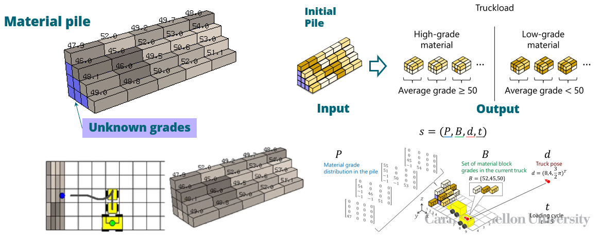
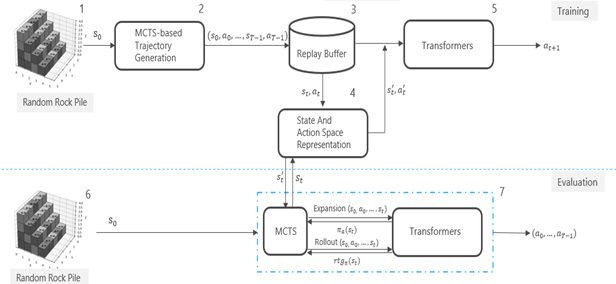
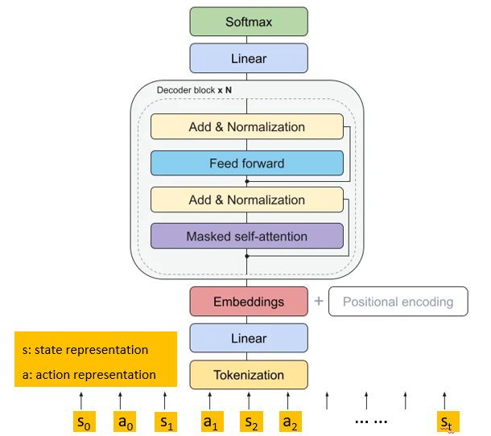
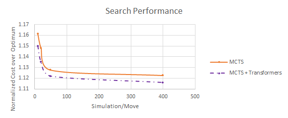

### Introduction  
The goal of this project is to develop a generative language model to optimize task planning for ore mining. The objective is to maximize the discovery of high-quality rocks while minimizing travel costs and energy consumption. By combining a Transformer-based language model with Monte Carlo Tree Search (MCTS), the model provides prior probabilities that enhance MCTS’s efficiency in managing complex rock piles. The goal is to develop an algorithm that can optimize ore mining task strategies, minimizing the total cost. This project aims to contribute to the mining industry by improving operational efficiency, reducing energy consumption, and ultimately promoting a more sustainable mining process.

    
    
<em>Figure 1: Problem Statement</em>

### Design
The proposed solution involves designing an algorithm that integrates a generative Transformer model with MCTS. The key idea is to use the language model to provide effective state and action representations that guide action selection within MCTS. The solution includes the development of spatial encoding for the 3D rock pile structure, representation of the ore grades, and normalization of distances to improve the quality of decision-making. The design also features the integration of a policy network that uses historical mining data to further enhance planning effectiveness. My role in this project includes developing the spatial encoding methods, designing the state and action representation strategy, and leading the integration of these components with MCTS.

    
    
<em>Figure 2: Algorithm Flow Chart</em>

### Evaluation
To evaluate the proposed model, we conducted small-scale tests focusing on the effectiveness of spatial encoding and the normalization methods used to represent 3D relationships, ore grades, and distances. These tests aim to determine whether the designed representations can meaningfully guide decision-making. The evaluation shows promising results, indicating that the approach is effective in optimizing task planning strategies.

### Methods  
1. **3D Structure Encoding**: A spatial encoding method was developed to represent the 3D relationships among rocks, digging points, and unloading points.
2. **Distance Normalization**: Normalizing distances between digging and unloading points aims to optimize travel costs, helping the model make more efficient decisions.
3. **Policy Network Development**: The state and action representations, incorporating the 3D structure, ore grades, and distances, are currently being developed. The model will eventually be trained using historical data.

    
    
<em>Figure 3: Transformer Architecture</em>

### Results  
Preliminary evaluations indicate that the spatial encoding and distance normalization methods effectively capture the complex relationships inherent in ore mining. Quantitative results show that the cost incurred using the MCTS approach is 115% of the optimal solution, while integrating the generative language model with MCTS reduces this cost to 105% of the optimal solution. This translates to a reduction of approximately 8.7% in operational costs compared to using MCTS alone. Such an improvement highlights the ability of the Transformer-based generative model to make more informed decisions, thus leading to better planning and reduced resource consumption.

    
    
<em>Figure 4: Preliminary Training Result</em>

### Conclusion  
The integration of a Transformer-based language model with MCTS shows promising potential in optimizing ore mining planning. The project will proceed with finalizing state and action representations and training the model using historical mining data. Once complete, the system will be used to demonstrate its ability to minimize total costs in ore mining task planning. 
