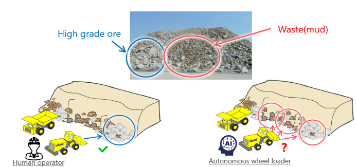
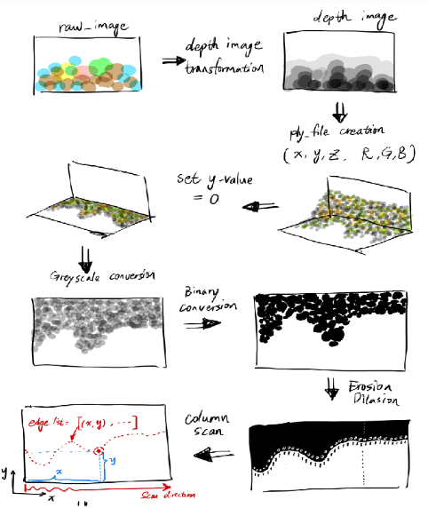
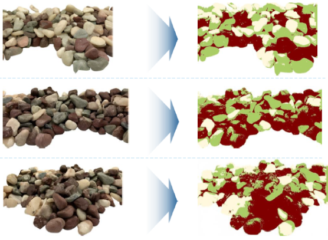
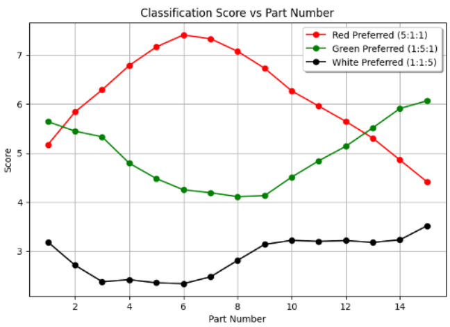
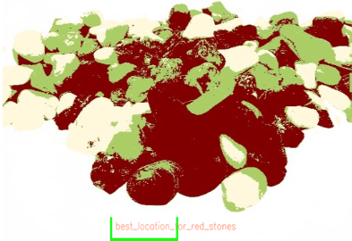

### Introduction
Mining plays an essential role in our society, providing critical materials like gold, copper, and iron, which are fundamental for modern infrastructure and technology. The goal of this project is to develop a method to optimize digging locations in rock mining operations by using camera image data and computer vision techniques. Our focus is on determining optimal digging locations to maximize the total score, which combines the quantity and quality of stones scooped. This project aims to address the inefficiencies of autonomous wheel loaders, which lack the ability to distinguish high-quality ore from waste rock as human operators do, thereby enhancing operational efficiency, reducing costs, and promoting sustainable mining practices.

    
    
<em>Figure 1: The challenge to deploy autonomous wheel loaders to real site</em>

### Design
The project is designed around a combination of edge cost evaluation and stone clustering techniques to determine optimal digging locations. The edge cost evaluation method identifies areas that maximize bucket volume by avoiding cavities, while the stone clustering process categorizes stones based on their visual features. Together, these methods determine the best digging locations based on factors such as surface flatness and stone quality. The use of stereo vision and Gaussian Mixture Model (GMM) clustering enhances the ability of autonomous wheel loaders to differentiate between high-value ore and waste rock. My role in this project includes designing and implementing the stone clustering and edge evaluation methodologies, contributing to both the technical development and the overall project strategy.

    
    
<em>Figure 2: Experiment Design</em>

### Evaluation
We evaluated our approach through a series of experiments that involved analyzing the effectiveness of edge flatness detection and stone categorization. The evaluation also covered the use of GMM for clustering, which proved effective in categorizing stones of varying colors. Although some challenges in accurate classification were observed, mainly due to lighting conditions and camera limitations, the combined scoring approach, using both edge and color scores, demonstrated promising results for identifying optimal digging locations and improving overall efficiency.

### Method
1. **Edge Cost Evaluation**:  This method identifies the most suitable digging locations by evaluating the variance in the edge profile of the rock pile. A lower variance indicates a flatter surface, resulting in a higher score for the corresponding digging position.                   
2. **Stone Clustering**: Stones are categorized into three types (green, red, and white) using GMM after filtering the image with the Pyramid Mean Shift filter. This categorization helps to identify the distribution of stone types across the pile, which contributes to determining optimal digging locations.          
3. **Score Calculation**: A combined score is calculated using both edge and stone color scores. The edge score is weighted by a factor (e.g., 0.4) and the color score by another factor (e.g., 0.6) to arrive at the final score for each digging location.             

### Results  
The combined use of edge cost evaluation and stone clustering resulted in improved decision-making regarding the optimal digging locations. The GMM clustering effectively revealed the distribution of different stone types, though there were some classification inaccuracies. Despite these challenges, the overall approach shows strong potential for improving mining efficiency by providing a systematic way to evaluate digging positions. The results indicate that the integration of these techniques can enhance the capability of autonomous wheel loaders, making them more effective at extracting valuable ore while minimizing waste.

    

        
        
<em>Figure 3: Original and Clustered Stone Pile Segments</em>

    

    

        
        
<em>Figure 4: Classification/Color Score versus Part Number</em>

    

### Conclusion
The integration of edge cost evaluation with stone clustering techniques provides an effective way to determine optimal digging locations for autonomous wheel loaders. This project has demonstrated promising results in optimizing rock mining operations, with the potential to reduce operational costs and improve the quality of ore extraction. Future work may include enhancing classification accuracy through deep learning approaches such as Convolutional Neural Networks or deep reinforcement learning for more precise and adaptive decision-making. My contributions have focused on developing and refining the clustering and evaluation methods, which are integral to achieving the project’s objectives, ensuring that the final solution is both technically sound and impactful for the mining industry.

    
    
<em>Figure 5: Best location for Red Stones Mining</em>

