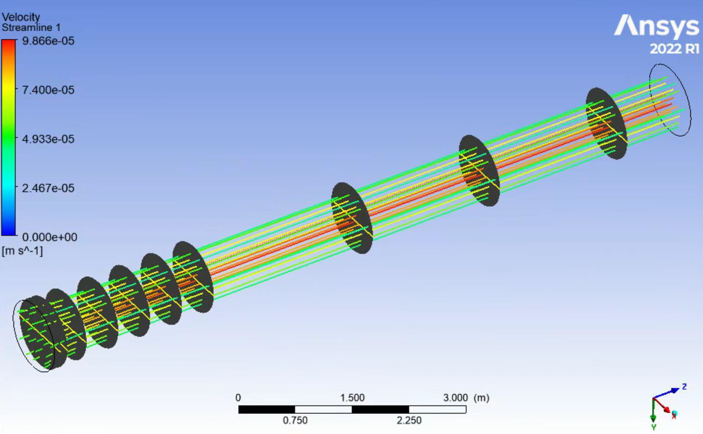
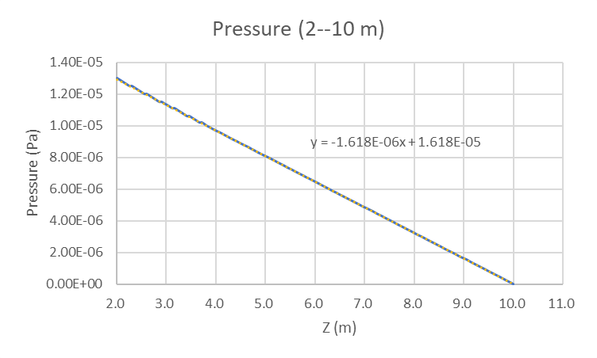

### Intruduction
This report provides a detailed analysis of axial velocity profiles and pressure gradients within pipe flows, employing computational fluid dynamics (CFD) simulations in ANSYS. It aims to demonstrate the characteristics of developing and fully developed flow regions in a standardized pipe setup. By emphasizing the transition between these regions, the results provide insights into enhancing the efficiency of fluid transport systems in various engineering applications. This study not only deepens the understanding of fluid dynamics under controlled parameters but also serves as an important resource for designing more effective fluid handling infrastructure.

    
    
<em>Figure 1: Pipe and Streamline</em>

### Method
The methodology employed involves the simulation of pipe flow using ANSYS 2022, under various conditions defined by Reynolds numbers, fluid density, viscosity, and flow rates. Axial velocity profiles were measured at ten different positions along the pipe to capture transition from developing to fully developed flow. Pressure gradients were similarly assessed to correlate the flow dynamics with theoretical predictions. The simulations extended across a range of Reynolds numbers to encompass both laminar and transitional flow regimes.

### Results
The results indicate a close alignment between the simulated and theoretical velocity profiles and pressure gradients. At the outlet (z = 9m), the observed flow rate exhibited a minimal percentage error of 0.79% compared to predicted values, affirming the simulation’s accuracy. Pressure analysis revealed a consistent gradient in the fully developed region, with an error margin of approximately 1.14% against theoretical expectations. Additionally, the entrance length, a critical measure of flow development, was accurately predicted within a 4.5% error margin across several simulations.

    
    
<em>Figure 2: Pressure Profile in Fully Developed Region</em>

### Discussion
The findings validate the utility of CFD in modeling complex fluid dynamics and support its application in engineering design and analysis. While the results are promising, the minor discrepancies noted suggest potential areas for improving simulation accuracy, possibly through enhanced resolution or more extensive parameter testing. Future studies could focus on refining these aspects to further align experimental simulations with theoretical models, thereby enhancing predictive capabilities and application scope in fluid mechanics.