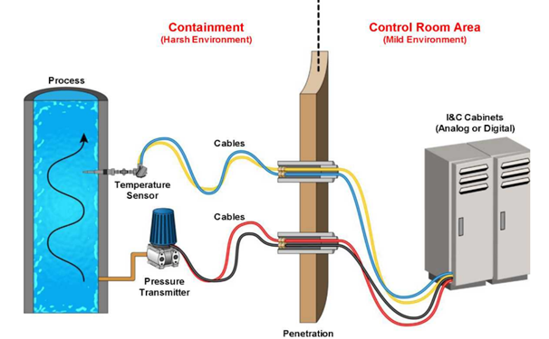
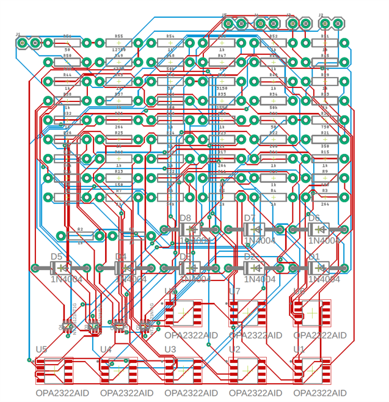
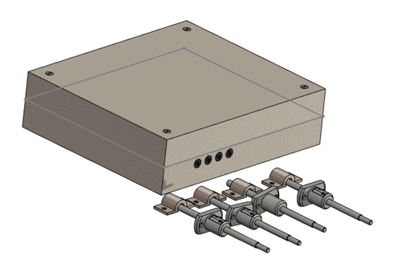
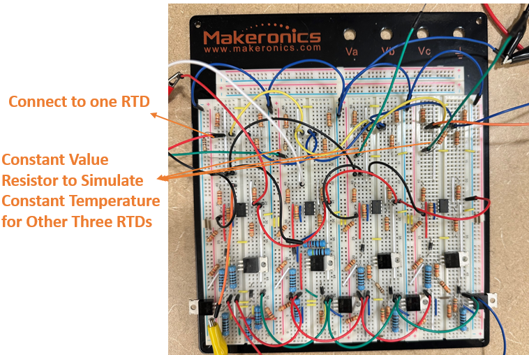

### Introduction
This project proposes a proof-of-concept design for a multi-location temperature detection system, specifically tailored for high-radiation environments. By utilizing analog circuits and reducing the reliance on digital components, the system aims to provide accurate and reliable temperature readings while minimizing radiation-induced damage. The design emphasizes simplicity and robustness to meet the demands of extreme conditions.

    
    
<em>Figure 1: Process Sensing System and Connections in a Nuclear Power Plant</em>

### Design
The system integrates a Wheatstone Bridge and MOSFET-based signal processing to detect and merge temperature signals into a single analog output. This configuration ensures signal stability and reduces noise interference. Key design considerations include a compact form factor, waterproofing for humidity tolerance, and resistance adjustments to refine the temperature range.

    

        
        
<em>Figure 2: Temperature Detector Circuit</em>

    

    

        
        
<em>Figure 3: Radiation Shield and Sensor Design</em>

    

### Method
The design process involved iterative simulations and validations using TINA TI to ensure precise signal behavior. Parameters like amplifier gain and RTD resistance were adjusted to optimize temperature detection and range adaptability. Prototyping and testing were performed under controlled conditions to evaluate the system's accuracy and durability.

### Evaluation
The design was validated through circuit simulations and prototype testing, demonstrating its ability to detect temperature changes reliably across multiple locations. Simulations confirmed bounded signal outputs with minimal noise, while adjustments in resistor values allowed for fine-tuning of detection ranges. However, errors were noted in higher RTD configurations, suggesting potential areas for improvement.

    
    
<em>Figure 4: Temperature Detector Prototype Testing</em>

### Results
The prototype successfully merged temperature readings from multiple RTDs into a single analog output, meeting the project's functional requirements. Testing showed accurate detection for the first two RTDs, with slight discrepancies in the third and fourth sensors. The device maintained functionality under high humidity and radiation conditions, with output currents ranging from 33.2mA to 100mA.

### Conclusion
This project demonstrates the feasibility of a multi-location temperature detection system designed for harsh environments. By focusing on analog circuitry, the system overcomes radiation-related challenges common to digital components. Future improvements include optimizing resistor tolerances, incorporating comparators for enhanced precision, and developing a dedicated power module for streamlined integration.